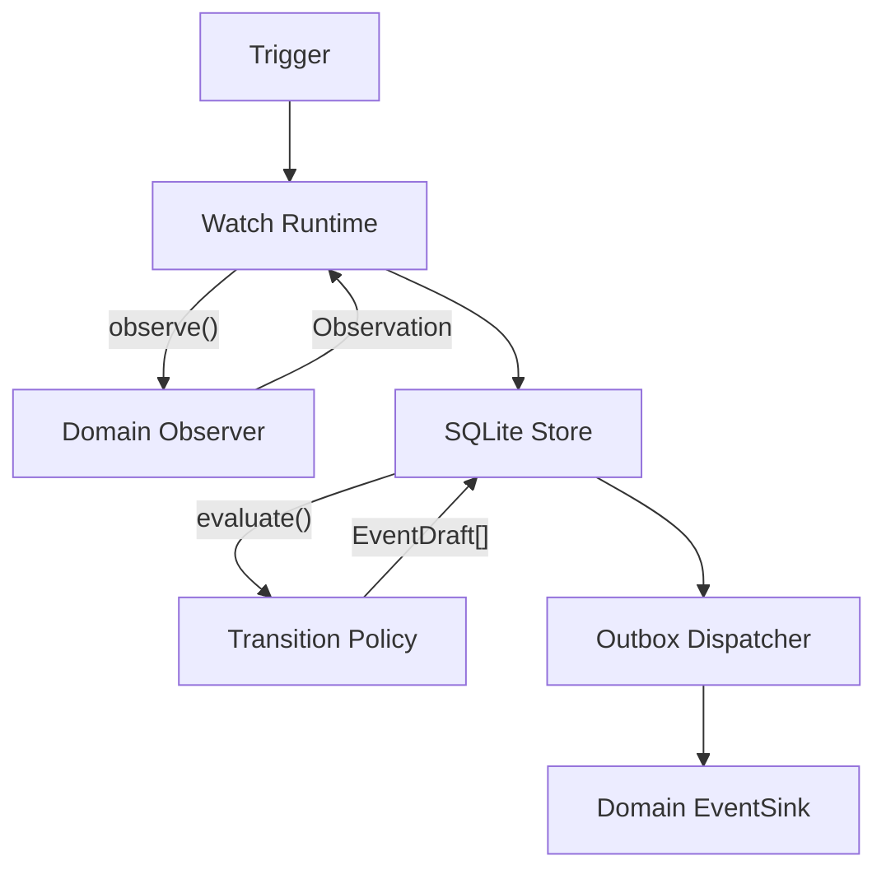
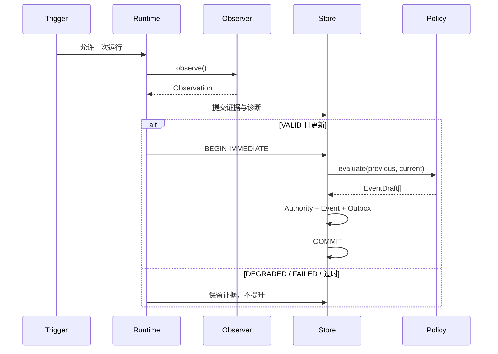
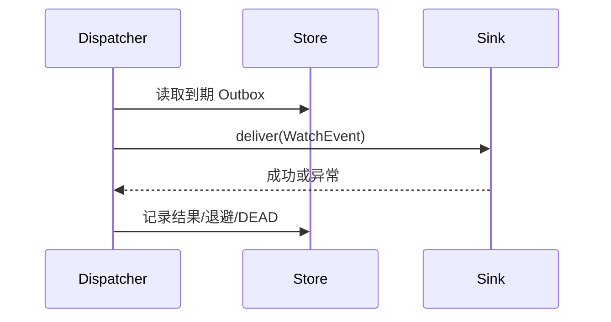
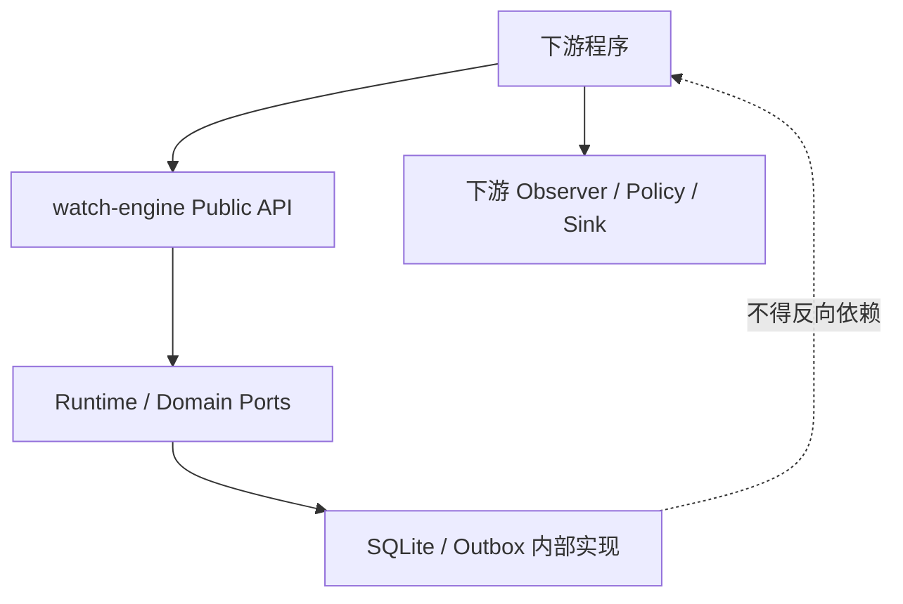

# watch-engine 架构设计

## 1. 文档目的

本文描述 `watch-engine` v0.1 的程序架构、模块边界、核心对象、执行流程、持久化事务、并发与失败语义，以及对下游保持稳定的集成契约。

需求依据见 [模块需求说明](module-requirements.zh-CN.md)，当前版本的具体代码与数据落地见 [实际落地技术方案](implementation.zh-CN.md)，下游接入步骤见 [采用指南](adoption-guide.zh-CN.md)。

## 2. 架构目标

架构优先保证：

1. 领域无关：引擎不理解下游状态含义。
2. 可信状态：观测失败不能伪装成领域状态变化。
3. 事务一致：Authority、Event 与 Outbox 不出现部分提交。
4. 可恢复：失败和重启后不丢失已提交事件。
5. 可采用：下游通过少量公开接口完成组合，不修改核心。
6. 可演化：Public API、事件 Schema 与内部实现分层版本化。

## 3. 系统边界

`watch-engine` 内部负责调度、运行控制、证据持久化、Authority 提升、事件持久化和 Outbox 投递。

下游负责：

- 访问网站、API、文件或其他领域数据源；
- 把证据分类成 Observation；
- 解释前后领域状态并创建 EventDraft；
- 向通知网关或其他系统投递 WatchEvent；
- 管理业务配置、秘密和进程部署。

## 4. 分层结构

### 4.1 Public API 层

下游允许依赖的类型和入口：

- `WatchDefinition`
- `WatchRuntime`
- `WatchRunner`
- `Observation`
- `EventDraft`
- `WatchEvent`
- `IntervalTrigger`
- `CronTrigger`
- `ManualTrigger`
- `SQLiteStore`
- `OutboxDispatcher`
- Observer、TransitionPolicy、EventSink 所需的公开 Protocol/调用约定
- `schemas/watch-event-v1.json`

Public API 的兼容性由 Semantic Versioning 管理。

### 4.2 Application / Runtime 层

负责一次 Watch 的编排：

1. 等待 Trigger；
2. 调用 Observer 并执行有界重试；
3. 保存 Observation 和运行诊断；
4. 对有效且未过时的 Observation 发起 Authority 提升；
5. 返回结构化运行结果。

Runtime 不解释领域状态，不直接投递通知。

### 4.3 Domain Extension 边界

由下游实现：

- **Observer**：领域 I/O、解析、证据分类；
- **TransitionPolicy**：无 I/O 的领域转换判断；
- **EventSink**：数据库事务提交后的外部投递。

三个边界刻意分离，避免慢速网络调用进入 SQLite 写事务，也避免通知失败破坏 Authority。

### 4.4 Persistence 层

`SQLiteStore` 是 v0.1 的单节点持久化实现，负责：

- Schema 初始化与版本；
- Watch 运行元数据；
- Observation 证据；
- Current Authority 引用；
- WatchEvent；
- Outbox；
- Delivery Attempt。

数据库表结构属于内部实现，不是跨工程 API。

### 4.5 Delivery 层

`OutboxDispatcher`：

- 领取到期 Outbox 记录；
- 调用 EventSink；
- 记录成功或失败尝试；
- 计算有界指数退避；
- 重试耗尽后标记 `DEAD`。

v0.1 要求每个 SQLite 数据库同一时刻只有一个活跃的 `OutboxDispatcher` 所有者。
`recover_in_flight()` 会在 Dispatcher 实例第一次运行时把全部 `DELIVERING` 视为上一个进程的
中断遗留；如果两个 Dispatcher 同时工作，新实例可能错误恢复另一个仍在投递的事件并造成并发重复。
at-least-once 允许崩溃后的重复投递，但不把多 Dispatcher 并发协调作为 v0.1 支持能力。

## 5. 核心执行流程

### 5.1 观测与 Authority 提升

### 5.2 Outbox 投递

## 6. Observation 与 Authority 模型

### 6.1 Observation 是证据

每次完成的观测都应保存，包含：

- 质量分类；
- 带时区的 `observed_at`；
- 领域状态；
- 可选证据和诊断信息。

Observation 被保存不等于它被接受为 Authority。

### 6.2 Authority 是可信投影

Authority 只指向当前最新、被接受的 `VALID` Observation。

规则：

- `DEGRADED`：有部分证据，但不足以改变 Authority；
- `FAILED`：无法可靠观测，同样不改变 Authority；
- 过时或同时间戳的 `VALID`：只保留证据；
- 更新的 `VALID`：进入原子提升事务。

这种区分防止“网站暂时打不开”被解释成“商品下架”，也适用于任何下游领域。

## 7. 事务设计

### 7.1 第一事务：证据提交

完成的 Observation 与运行诊断首先提交。

目的：即使后续 Policy 或提升失败，失败现场仍可被审计。

### 7.2 第二事务：Authority 提升

对于候选 `VALID` Observation，使用 SQLite `BEGIN IMMEDIATE` 串行化提升决策：

1. 重新读取当前 Authority；
2. 检查候选时间是否仍然更新；
3. 调用 TransitionPolicy；
4. 插入 WatchEvent；
5. 插入对应 Outbox；
6. 替换 Authority；
7. 一次性提交。

Policy 抛出异常或任一步失败时，Authority、Event、Outbox 一起回滚。

### 7.3 为什么 Policy 位于写事务中

Previous Authority、领域决策、Event 和 New Authority 必须依据同一份串行状态。若 Policy 在事务外求值，并发运行可能基于已失效的 Previous Authority 产生错误事件。

代价是 Policy 必须快速、确定且无外部 I/O。网络访问和不可逆副作用只能发生在 Observer 或 EventSink。

## 8. 并发与顺序

v0.1 是单节点模型，但同一 `watch_id` 的 Observer 调用可以重叠。

处理规则：

- Observer 阶段允许并行；
- Authority 提升由 SQLite 写事务串行化；
- `observed_at` 决定证据新旧，不使用完成顺序；
- 小于或等于当前 Authority 时间戳的候选不得调用 Policy；
- 同时间戳采用保守的先到者胜出；
- Observer 若可能被并发调用，线程安全由其实现者负责。

`watches.run_status` 是最后一次写入的诊断快照，不是活跃运行计数器。同一个 `watch_id` 的
Observer 重叠时，一个较早完成的运行可能把状态写回 `IDLE`，而另一个运行仍在执行。因此下游
不得使用该字段进行调度互斥、健康判定或 Authority 决策。

SQLite 不是分布式锁，因此多个主机共享数据库不属于 v0.1 支持范围。

## 9. 事件身份和投递语义

### 9.1 Event 身份

- `event_id`：一次事件发生的稳定身份，也是投递幂等键；
- `dedupe_key`：下游定义的领域关联信息，不设置全局唯一约束；
- 相同转换以后重新发生，会创建新的 `event_id`。

### 9.2 at-least-once

存在以下不可消除的窗口：

1. EventSink 已接受事件；
2. 进程在 SQLite 记录成功前退出；
3. 重启后相同事件再次投递。

因此引擎承诺 at-least-once，不承诺 exactly-once。EventSink 必须按 `event_id` 幂等。不得通过在引擎中静默丢弃可能重复的投递来伪造 exactly-once。

## 10. 失败处理

### 10.1 Observer 异常

- 按 Watch 配置进行有界重试；
- 耗尽后形成 `FAILED` Observation；
- 保存异常类型和尝试次数；
- 不改变 Authority。

### 10.2 Observer 主动降级/失败

这代表 Observer 已完成证据分类，立即保存，不隐式重试。

### 10.3 Policy 失败

- Authority、Event、Outbox 回滚；
- Observation 保留；
- 不执行 EventSink。

### 10.4 EventSink 失败

- 不回滚 Authority 或 Event；
- 保存 Delivery Attempt；
- 计算下一次投递时间；
- 耗尽后进入 `DEAD`，等待运维诊断。

### 10.5 进程重启

SQLite 中已提交的 Authority、Event、Outbox 和尝试记录保持有效。在确认旧 Dispatcher 已退出并
取得数据库的唯一投递所有权后，新 Dispatcher 会恢复遗留的 `DELIVERING` 并继续到期投递。

## 11. 对外契约

### 11.1 Python Public API

下游应从包公开入口导入类型，不导入带下划线的私有模块，不继承内部 SQLite 实现。

### 11.2 Watch Event v1

跨进程或跨工程传输使用 `schemas/watch-event-v1.json`。v0.1.0 的 wheel 不包含这个仓库级
Schema；消费者应从固定 Release Tag 获取并随自身版本固定保存，而不是读取会继续变化的 `main`：

`https://raw.githubusercontent.com/kongbu0621/watch-engine/v0.1.0/schemas/watch-event-v1.json`

兼容性规则：

- v1 内新增可选字段可以是向后兼容变更；
- 删除字段、改变语义或收紧已有合法值属于破坏性变更；
- 破坏性变更必须引入新 Schema 版本和迁移说明。

### 11.3 SQLite 非契约

下游不得把内部表名、列名、索引或迁移细节当作 API。需要查询或管理能力时，应先形成明确的公开需求和接口，而不是直接耦合数据库。

## 12. 依赖方向

核心不得 import 或依赖任何具体下游。下游可以依赖 Public API，并通过组合注入领域实现。

## 13. 部署边界

v0.1 提供运行组件，不提供通用 daemon CLI 或进程监督器。

推荐下游负责：

- 组合 WatchDefinition；
- 管理 Runtime 与 Dispatcher 循环；
- 保证每个 SQLite 数据库只有一个活跃 Dispatcher；
- 选择 SQLite 文件位置；
- 加载配置和秘密；
- 使用 systemd、容器或其他监督方式运行进程；
- 记录业务日志和可观测指标。

`WatchRunner.serve()` 的 stop event 只在两次运行之间检查。若当前仍在等待长 Interval/Cron，设置
stop 不会立即唤醒 Trigger；需要及时停机的下游应取消外层 asyncio Task 或自行实现信号/超时编排，
并等待正在执行的同步 `run_once()` 和数据库事务安全结束。

未来只有在多个下游出现相同、稳定的 daemon 需求后，才考虑将其抽入核心。

## 14. 测试架构

核心测试应覆盖：

- Trigger 时间与时区行为；
- Observer 异常和重试耗尽；
- `DEGRADED` / `FAILED` 不覆盖 Authority；
- 乱序和同时间戳 Observation；
- Policy 失败事务回滚；
- Event/Outbox 原子创建；
- 投递成功、失败、退避、重启恢复和 `DEAD`；
- `event_id` 稳定性；
- Watch Event v1 Schema；
- Python 支持版本与静态检查。

测试使用 Fake Observer、Policy 和 Sink，不连接真实网站或通知服务。

## 15. v0.1 限制

- 单节点 SQLite；
- 每个数据库只支持一个活跃 Outbox Dispatcher；
- Observer 和 EventSink 是同步边界；
- 不提供分布式协调；
- 不提供动态插件加载；
- 不提供 Web UI；
- 不提供特定抓取器或通知适配器；
- 不承诺内部数据库 Schema 兼容；
- 进程监督由下游负责。

这些是明确的版本边界，不应被误报为实现缺陷。

## 16. 架构演进规则

新增核心能力前必须证明：

1. 至少两个独立下游具有相同需求，或首个采用者暴露了不可避免的通用缺口；
2. 能力属于 Condition Watch Runtime，而非某个领域；
3. 可以通过稳定接口实现；
4. 有故障语义、兼容策略和自动化测试；
5. 不破坏 Observer、Authority、Policy、Event、Outbox 的可信链路。

独立下游接入的主要目的，是验证这些边界是否真的可用，而不是让核心吸收任何特定业务逻辑。公开文档只保留匿名验证结论。

## 17. 隐私、安全与数据生命周期

- SQLite 路径不得为符号链接；POSIX 下数据库、WAL、SHM 强制为 `0600`，父目录由部署方设为 `0700`；
- Runtime 与 Dispatcher 捕获异常时只保存异常类型和固定文案，不记录异常消息或 traceback；
- 调用方主动提供的 state、evidence、error、subject、payload 必须在进入引擎前完成最小化和脱敏；
- 单个 JSON 字段编码上限为 1 MiB，error 上限为 2,048 字符；
- `purge_before()` 只清理终态投递历史与非 Authority 观测，未投递事件与当前 Authority 始终保留；
- `delete_watch()` 默认拒绝删除未投递事件，显式 override 才允许破坏性删除；
- `compact_storage()` 只在其他数据库所有者停止后执行；备份、快照、SSD 映射和外部日志不在 SQLite 擦除保证内。

这些措施用于降低意外泄露和无限增长风险，但引擎不是个人信息处理平台或法律合规边界。部署方仍需确定数据分类、保留期限、访问控制及适用法域。
