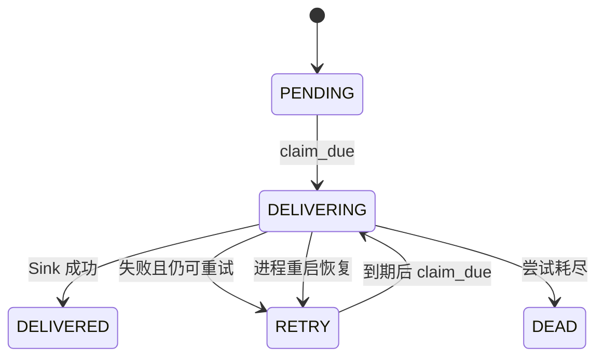

# watch-engine 实际落地技术方案

## 1. 文档目的

本文描述 `watch-engine` v0.1 当前版本如何在代码、数据、配置、测试、CI 和发布层面实际落地，并建立“模块需求 → 架构设计 → 代码实现”的可追踪关系。

本文不是需求文档，也不是抽象架构说明：

- “做什么、为什么做、如何验收”见 [模块需求说明](module-requirements.zh-CN.md)；
- “系统怎样分层、关键设计为何成立”见 [架构设计](architecture.zh-CN.md)；
- “其他工程怎样接入”见 [下游采用指南](adoption-guide.zh-CN.md)；
- 本文回答“v0.1 在哪些文件中、使用哪些类和数据结构、以什么配置和执行步骤具体实现”。

## 2. 实现基线

| 项目 | v0.1 落地选择 |
|---|---|
| 语言 | Python 3.11+ |
| 包名 | `watch-engine` |
| 源码包 | `src/watch_engine` |
| 构建后端 | setuptools |
| 持久化 | SQLite 3 |
| SQLite 日志模式 | WAL |
| 调度 | asyncio Trigger |
| 领域边界 | 同步 Observer / TransitionPolicy / EventSink Protocol |
| 事件投递 | Transactional Outbox，at-least-once |
| 时间 | 带时区 datetime，持久化为 UTC/RFC 3339 兼容文本 |
| 数据编码 | 确定性 JSON |
| 唯一身份 | UUID 字符串 observation_id / event_id |
| 自动化测试 | pytest |
| 静态检查 | Ruff + mypy strict |
| CI | GitHub Actions，Python 3.11/3.12/3.13 |
| 许可证 | Apache License 2.0 |

运行时依赖仅包含 `croniter>=2.0,<7`。pytest、mypy、Ruff、jsonschema 和 rfc3339-validator 位于 `dev` 可选依赖。

## 3. 仓库与代码映射

```text
watch-engine/
├── .github/workflows/ci.yml         # 测试矩阵和静态检查
├── schemas/watch-event-v1.json      # 跨工程事件契约
├── src/watch_engine/
│   ├── __init__.py                  # Public API 汇总
│   ├── interfaces.py                # Observer / Policy / Sink / Trigger Protocol
│   ├── models.py                    # 不可变领域模型和重试配置
│   ├── runtime.py                   # WatchDefinition、单次运行与 Trigger 适配
│   ├── triggers.py                  # Interval / Cron / Manual Trigger
│   ├── storage.py                   # SQLite Schema、事务、Authority、Outbox
│   ├── delivery.py                  # OutboxDispatcher
│   ├── _json.py                     # JSON 校验和确定性编解码
│   ├── _time.py                     # 时区校验和 UTC 时间转换
│   └── py.typed                     # 类型信息标记
├── tests/                           # 核心行为、故障和契约测试
├── pyproject.toml                   # 构建、依赖、版本和工具配置
├── README.md
└── README.zh-CN.md
```

下游只能把 `src/watch_engine/__init__.py` 导出的对象以及公开 Schema 视为稳定契约。以下划线开头的模块和 SQLite 内部表不属于兼容性承诺。

## 4. Public API 落地

`src/watch_engine/__init__.py` 是公开导入入口，当前导出：

### 4.1 运行编排

- `WatchDefinition`
- `WatchRuntime`
- `WatchRunner`
- `RunResult`

### 4.2 扩展接口

- `Observer`
- `TransitionPolicy`
- `EventSink`
- `Trigger`

### 4.3 模型与配置

- `Observation`
- `ObservationStatus`
- `EventDraft`
- `WatchEvent`
- `RetryPolicy`
- `DeliveryConfig`
- `DeliveryResult`

### 4.4 内置实现

- `IntervalTrigger`
- `CronTrigger`
- `ManualTrigger`
- `SQLiteStore`
- `OutboxDispatcher`

新增公开能力时，必须先判断它属于公共契约还是内部实现；公开导出后必须纳入 Semantic Versioning 和兼容性测试。

## 5. 核心模型实现

### 5.1 Observation

实现位置：`src/watch_engine/models.py`

`Observation` 使用 `frozen=True, slots=True` 的 dataclass，字段包括：

| 字段 | 类型/用途 |
|---|---|
| `status` | `VALID / DEGRADED / FAILED` |
| `observed_at` | 带时区证据取得时间 |
| `state` | 可 JSON 序列化的领域状态 |
| `evidence` | JSON Object 诊断证据 |
| `error` | 可选错误文本 |

落地约束：

- 构造时通过 `require_aware` 拒绝无时区时间；
- `state` 与 `evidence` 通过 `validate_json` 校验；
- 提供 `valid()`、`degraded()`、`failed()` 工厂方法；
- 只有 `VALID` 能进入 Authority 提升流程。

### 5.2 EventDraft 与 WatchEvent

`EventDraft` 是 Policy 的临时输出，不拥有事件身份。

`SQLiteStore._insert_events()` 将其转换为 `WatchEvent`：

- 通过 `event_id_factory` 生成 UUID；
- `schema_version` 固定为 `"1.0"`；
- `occurred_at` 使用 Current Observation 的 `observed_at`；
- 同一事务插入 Event 和 Outbox。

`WatchEvent.to_dict()` 生成跨工程传输对象；外部消费者再依据 `schemas/watch-event-v1.json` 校验。

### 5.3 RetryPolicy

默认 Observer 重试配置：

| 参数 | 默认值 |
|---|---:|
| `max_attempts` | 3 |
| `base_delay_seconds` | 1.0 |
| `maximum_delay_seconds` | 60.0 |
| `multiplier` | 2.0 |

延迟公式：

`min(base_delay × multiplier^(failure_number-1), maximum_delay)`

参数在 dataclass 初始化时校验，拒绝无效次数、非正延迟和小于 1 的倍数。

### 5.4 DeliveryConfig

默认投递配置：

| 参数 | 默认值 |
|---|---:|
| 投递最大尝试次数 | 5 |
| 首次退避 | 1.0 秒 |
| 最大退避 | 60.0 秒 |
| 倍数 | 2.0 |
| `batch_size` | 100 |

Observer 重试与 Event 投递重试是两套独立配置，不得混用。

## 6. Runtime 实现

实现位置：`src/watch_engine/runtime.py`

### 6.1 WatchDefinition

`WatchDefinition` 组合：

- 稳定 `watch_id`；
- Trigger；
- Observer；
- TransitionPolicy；
- Observer RetryPolicy。

初始化时拒绝空 `watch_id`。

### 6.2 run_once 执行步骤

`WatchRuntime.run_once(definition)` 的实际顺序：

1. `SQLiteStore.mark_run_started()`：
   - 确保 Watch 行存在；
   - 将 `run_status` 设为 `RUNNING`；
   - 更新 `last_started_at`；
   - 清除上一轮 `last_error`。
2. `_observe()`：
   - 同步调用 `Observer.observe()`；
   - 异常时按 Observer RetryPolicy 调用可注入的 `sleep`；
   - 重试耗尽后创建 `FAILED` Observation，证据记录异常类型和尝试次数。
3. `SQLiteStore.record_observation()`：
   - 先持久保存证据；
   - 只有 `VALID` 继续 Authority 提升。
4. 持久化或提升异常：
   - 调用 `mark_run_error()`；
   - 记录异常日志；
   - 重新抛出，交给下游进程处理。
5. 返回 `RunResult(observation, events)`。

Clock 和 sleep 均可注入，便于测试时间与重试行为。

### 6.3 WatchRunner

- `run_next()` 等待 `Trigger.wait_next()`；
- 使用 `asyncio.to_thread` 执行同步 `run_once()`，避免阻塞 asyncio Event Loop；
- `serve()` 在每次运行开始前检查外部 `asyncio.Event`。

`WatchRunner` 不是操作系统 daemon。进程生命周期、信号处理和服务监督由下游程序负责。
stop event 不会中断一个已经开始的 `Trigger.wait_next()`；长 Interval/Cron 的及时停机需要下游取消
外层 asyncio Task 或增加自己的信号/超时编排。已经进入 `asyncio.to_thread()` 的同步
`run_once()` 不能靠取消 await 强制终止，必须允许其事务安全完成。

## 7. Trigger 实现

实现位置：`src/watch_engine/triggers.py`

### 7.1 IntervalTrigger

构造参数：

- `minimum_interval > 0`；
- `maximum_interval >= minimum_interval`；
- 每次通过可注入 `random.uniform` 取得区间内延迟；
- 通过可注入 async sleep 等待。

随机源返回区间外值时抛出 `ValueError`，防止自定义随机实现破坏配置。

### 7.2 CronTrigger

- 构造时使用 `croniter.is_valid()` 校验表达式；
- 必须显式提供 `timezone`；
- `next_fire_time()` 将基准时间转换至该时区；
- `wait_next()` 计算距离下一次触发的秒数并异步等待；
- Clock 和 sleep 可注入测试。

### 7.3 ManualTrigger

- 使用进程内 `asyncio.Queue[None]`；
- 每次 `fire()` 放入一个请求；
- 每次 `wait_next()` 消耗一个请求；
- 不承诺跨进程或重启保存触发信号。

## 8. SQLite 落地方案

实现位置：`src/watch_engine/storage.py`

### 8.1 连接参数

每次操作建立独立连接并配置：

```sql
PRAGMA foreign_keys = ON;
PRAGMA busy_timeout = 5000;
PRAGMA journal_mode = WAL;
```

Python 连接参数：

- `isolation_level=None`，由代码显式控制事务；
- `timeout=5.0`；
- `row_factory=sqlite3.Row`。

v0.1 的数据库 Schema 版本为 `1`。如果现有数据库版本不等于代码支持版本，初始化直接失败，不进行静默迁移。

### 8.2 表结构

| 表 | 落地职责 |
|---|---|
| `schema_meta` | 保存数据库 Schema 版本 |
| `watches` | Watch 执行计数、运行状态、最近时间和错误 |
| `observations` | 保存每次不可变观测证据 |
| `authoritative_states` | 每个 `watch_id` 当前 Authority 指针及投影 |
| `events` | 持久 WatchEvent |
| `outbox` | 投递状态、锁、次数、下次时间和错误 |
| `delivery_attempts` | 每次投递尝试的审计记录 |

主要索引：

- `observations(watch_id, observed_at)`；
- `events(watch_id, dedupe_key)`；
- `outbox(status, next_attempt_at, outbox_id)`。

`outbox.event_id` 唯一，保证一个持久事件只有一条 Outbox 行；`events.dedupe_key` 不唯一，允许同类领域转换以后重新发生。

`watches.run_status`、开始/结束时间和 `last_error` 是最后写入的诊断快照。允许 Observer 重叠时，
它们不构成准确的活跃运行计数，也不得被下游当作调度锁或 Authority 来源。

### 8.3 第一事务：保存证据

`_persist_observation()` 使用 `BEGIN IMMEDIATE`：

1. 确保 `watches` 行存在；
2. 插入 `observations`；
3. 更新执行计数、运行状态、最后 Observation 状态和错误；
4. 提交。

失败时显式 rollback。此事务提交后，后续 Policy 或 Authority 提升失败不会抹掉证据。

### 8.4 第二事务：提升 Authority

`_promote_valid_observation()` 使用独立 `BEGIN IMMEDIATE`：

1. 读取当前 Authority；
2. 若 `current.observed_at <= previous.observed_at`：
   - 提交空变更并返回；
   - 保留已保存 Observation；
   - 不调用 Policy，不生成 Event。
3. 在事务内调用 `TransitionPolicy.evaluate(previous, current)`；
4. 为每个 EventDraft 插入 `events` 和 `outbox`；
5. UPSERT `authoritative_states`；
6. 一次提交。

任一步异常都会回滚第二事务，因此不会出现：

- Authority 已更新但 Event 丢失；
- Event 已创建但 Outbox 丢失；
- Policy 失败后 Authority 仍被提升。

## 9. Outbox 投递实现

实现位置：

- 调度：`src/watch_engine/delivery.py`
- 数据状态与事务：`src/watch_engine/storage.py`

### 9.1 状态机



### 9.2 Dispatcher 步骤

`OutboxDispatcher.dispatch_ready()`：

1. 当前 Dispatcher 实例首次运行时调用 `recover_in_flight()`，在取得数据库唯一投递所有权后恢复
   上个进程遗留的 `DELIVERING`；
2. 按 `batch_size` 调用 `claim_due()`；
3. 对每个 ClaimedEvent 同步调用 `EventSink.deliver()`；
4. 成功：`record_delivery_success()`，写入成功尝试并设为 `DELIVERED`；
5. 失败：
   - 计算 `failure_number = attempts + 1`；
   - 未耗尽则设置 `RETRY` 和 `next_attempt_at`；
   - 耗尽则设置 `DEAD`；
   - 保存错误和失败尝试；
6. 返回 `DeliveryResult` 集合。

### 9.3 一致性语义

如果 Sink 已接受事件、但进程在 SQLite 记录成功前退出，恢复后会再次投递同一 `event_id`。因此实际语义是 at-least-once。

落地要求：生产 EventSink 必须在外部服务或自身持久存储中按 `event_id` 幂等。进程内集合只能用于示例和测试。

v0.1 没有 Dispatcher 租约、进程身份或锁超时判断，`recover_in_flight()` 会恢复数据库中全部
`DELIVERING`。因此同一 SQLite 数据库只能有一个活跃 Dispatcher；进程监督器必须保证旧实例退出后
再启动替代实例。

## 10. JSON 与时间实现

### 10.1 JSON

`src/watch_engine/_json.py` 负责：

- 拒绝不可 JSON 序列化的 state/evidence/subject/payload；
- 确定性编码，避免键顺序导致不稳定持久化；
- 从 SQLite 文本恢复 JSON 值。

### 10.2 时间

`src/watch_engine/_time.py` 负责：

- 拒绝 naive datetime；
- 统一转为 UTC；
- 持久化为 ISO/RFC 3339 兼容文本；
- 从数据库文本恢复带时区 datetime。

Observation 新旧判断只使用 `observed_at`，不使用数据库插入时间或运行完成时间。

## 11. 运行组合方案

v0.1 不提供通用 CLI。下游入口程序负责组合：

```python
store = SQLiteStore(database_path)
runtime = WatchRuntime(store)
runner = WatchRunner(runtime)
dispatcher = OutboxDispatcher(store, sink, config=delivery_config)
```

建议单节点下游包含两个受监督循环：

1. Watch 循环：等待 Trigger 并执行 `runner.run_next(definition)`；
2. Delivery 循环：按下游选择的短间隔执行 `dispatcher.dispatch_ready()`。

每个 SQLite 数据库只允许一个活跃 Delivery 循环。停止流程由下游负责：设置 stop event 只能阻止
后续轮次，不能唤醒正在等待的长 Interval/Cron；需要及时停机时应取消等待 Trigger 的外层 Task，
但必须让已经进入 `run_once()` 的同步工作和当前数据库事务安全完成。不得在多个主机上把同一个
SQLite 文件当作分布式协调数据库。

## 12. 配置方案

引擎本体不读取环境变量或配置文件。所有配置由下游构造对象时显式传入：

| 配置 | 传入位置 |
|---|---|
| SQLite 路径 | `SQLiteStore(path)` |
| Trigger 时间 | Trigger 构造函数 |
| Observer 重试 | `WatchDefinition.observer_retry` |
| 投递重试和批量大小 | `DeliveryConfig` |
| 领域目标和认证 | 下游 Observer |
| 通知目标和认证 | 下游 EventSink |
| 进程日志 | 下游 logging 配置 |

这样可以避免核心绑定某种配置框架，并使测试可直接注入固定 clock、sleep、UUID factory 和 fake adapter。

## 13. 错误、日志与诊断

### 13.1 结构化诊断数据

长期状态保存于 SQLite：

- `watches.last_error`；
- Observation `error` 和 `evidence`；
- Outbox `last_error`；
- `delivery_attempts` 历史。

### 13.2 Python 日志

Runtime、Storage 和 Dispatcher 使用标准 `logging`，附带 `watch_id`、`event_id`、尝试次数等上下文。

引擎不配置 Handler、日志文件或采集服务，这些由下游部署决定。

### 13.3 DEAD 处理

v0.1 将耗尽重试的事件保留为 `DEAD`，但不提供管理 UI 或自动重放命令。运维必须能够查询诊断状态；未来若多个下游需要安全重放，再设计公开管理接口，不能要求下游直接修改 SQLite 表。

## 14. 测试落地方案

测试原则：

- 不访问网络；
- 不调用真实通知服务；
- 使用临时 SQLite；
- 使用可注入 clock、sleep、UUID factory、Observer、Policy 和 Sink；
- 测试结果不依赖真实时间和随机数。

必须覆盖：

1. 三种 Observation 状态及 JSON/时区校验；
2. Observer 抛出异常、退避与耗尽；
3. `DEGRADED / FAILED` 不替换 Authority；
4. 乱序和同时间戳 `VALID` 不提升；
5. Policy 在事务内运行且失败时回滚；
6. Event 和 Outbox 同事务创建；
7. 相同领域转换可以产生新的事件身份；
8. Outbox claim、成功、失败、退避、恢复和 `DEAD`；
9. Trigger 参数、时区和手动信号；
10. Watch Event v1 Schema；
11. Public API 可导入；
12. SQLite Schema 版本不匹配时 fail-fast。

文档示例必须对照当前 Public API，不得使用尚未实现的类、参数或 CLI。

PR #2 进一步增加直接回归：Public API 导出集合、SQLite Schema 版本 fail-fast、三层强制文档与
采用指南存在性、README 可发现性、相对链接解析，以及所有 Python 文档代码块的语法编译。这样
“文档完整”和“示例至少可编译”进入 CI，而不是只依赖人工目测。

## 15. CI 落地

`.github/workflows/ci.yml` 在 Pull Request 和 `main` push 上运行。

### 15.1 测试矩阵

- Ubuntu latest；
- Python 3.11；
- Python 3.12；
- Python 3.13；
- 安装 `.[dev]`；
- 执行 `python -m pytest`。

### 15.2 静态检查

Python 3.11 环境运行：

```bash
python -m ruff check .
python -m mypy src
```

mypy 对 `watch_engine` 使用 strict 模式。Ruff 目标版本为 Python 3.11，启用 E、F、I、UP、B、SIM 规则集。

### 15.3 包构建与隔离安装

CI 还必须：

1. 执行 `python -m build` 生成 sdist 和 wheel；
2. 创建全新虚拟环境；
3. 从 `dist/*.whl` 安装，包括声明的运行时依赖；
4. 离开仓库工作目录后导入 `watch_engine`；
5. 确认导入位置来自虚拟环境的 `site-packages`，而不是源码目录或 editable install。

这个 Job 验证包发现、构建元数据、wheel 内容和安装入口；它不能替代 Runtime 测试，也不声称
v0.1.0 wheel 包含仓库级 Event Schema。

## 16. 本地验证命令

```bash
python -m pip install -e ".[dev]"
python -m pytest
python -m ruff check .
python -m mypy src
```

测试完成后还应验证包构建：

```bash
python -m pip install build
python -m build
```

发布前建议在全新虚拟环境安装生成的 wheel，运行最小采用示例，确认未隐式依赖仓库源码路径。

2026-08-11 对 PR #2 的独立复核结果：

- `python -m compileall src tests`：通过；
- wheel 无隔离构建：通过；
- wheel 安装到全新 Python 3.12 虚拟环境，在显式提供声明的 `croniter` 依赖后从
  `site-packages` 导入：通过；
- wheel 内容核对：不包含仓库级 `schemas/watch-event-v1.json`。

最后一项是 v0.1.0 的已知分发边界，而不是未验证状态。跨工程消费者必须从固定 Tag URL 获取并
固定保存 Schema；若未来决定把 Schema 作为 package resource 分发，必须增加 wheel 内容测试并以
新版本发布，不能悄悄改变已经存在的 v0.1.0 产物。

## 17. 版本与发布方案

### 17.1 当前版本来源

`pyproject.toml` 中的 `project.version = "0.1.0"` 是 Python 包版本来源。

### 17.2 已发布基线

`v0.1.0` 已于 2026-08-10 12:58:57 UTC 正式发布，不是待发布状态：

- Git Tag：`v0.1.0`；
- GitHub Release：`watch-engine v0.1.0`；
- Release：<https://github.com/kongbu0621/watch-engine/releases/tag/v0.1.0>；
- Tag 指向提交 `9752398`；
- Release 非 Draft、非 Prerelease。

本 PR 的四份正式中文文档发生在该 Tag 之后，所以不会反向进入已经冻结的 v0.1.0 产物。不得移动或
覆盖 `v0.1.0` Tag。后续若真实采用暴露代码、打包或契约修复，应更新包版本并创建新的 Release；
只有文档变化时，也必须明确它描述的是已发布代码还是未来目标。

## 18. 需求—架构—实现追踪

| 需求 | 架构对象 | 代码落点 | 状态 |
|---|---|---|---|
| FR-01 Watch 定义 | Public API / Runtime | `runtime.WatchDefinition` | 已实现 |
| FR-02 Trigger | Trigger Port | `triggers.py` | 已实现 |
| FR-03 观测分类 | Observation Model | `models.Observation` | 已实现 |
| FR-04 Observer 重试 | Runtime | `WatchRuntime._observe` | 已实现 |
| FR-05 Authority | Persistence | `authoritative_states`、`_promote_valid_observation` | 已实现 |
| FR-06 状态转换 | TransitionPolicy Port | `interfaces.py`、Promotion Transaction | 已实现 |
| FR-07 原子持久化 | Transaction Boundary | `storage.py` 两段事务 | 已实现 |
| FR-08 事件身份 | Event Model | `EventDraft / WatchEvent / _insert_events` | 已实现 |
| FR-09 可靠投递 | Outbox / Dispatcher | `outbox`、`delivery_attempts`、`delivery.py` | 已实现 |
| FR-10 跨工程契约 | Event Schema | `schemas/watch-event-v1.json` | 已实现 |
| 独立采用验证 | 下游工程 | `apple-refurb-monitor` | 待完成 |
| wheel 构建与隔离导入 | Release 复核 | wheel + 全新 Python 3.12 venv | 已复核通过 |
| Schema wheel 分发 | 打包边界 | v0.1.0 wheel 不包含仓库级 Schema | 已知限制，使用固定 Tag URL |
| Git Tag / Release | Release 流程 | GitHub `v0.1.0` | 已完成（2026-08-10） |

“已实现”表示代码落点存在；最终完成仍以自动化测试、CI 和真实下游验证为准。

## 19. 当前缺口与下一步

### P0：合并前文档闭环

- 确认三层文档和采用指南互相链接；
- 检查文档示例与 Public API；
- 确认 PR 仅修改正式文档和仓库维护指引，不修改 Runtime、Schema 或 Public API。

### P1：首个真实采用验证

在 `apple-refurb-monitor` 中：

- 实现 Apple Observer；
- 实现库存 TransitionPolicy；
- 实现指向通知边界的 EventSink；
- 以固定版本安装 `watch-engine`；
- 验证失败证据、Authority、Event、Outbox、重试与重启；
- 将通用缺口与 Apple 领域需求分开记录。

### P2：真实采用后的维护版本

真实采用验证完成后：

- 修复确认的通用缺口；
- 重跑 CI；
- 构建 wheel；
- 在全新虚拟环境安装验证；
- 按 Semantic Versioning 更新版本号；
- 创建新 Tag 和 Release Notes；
- 永不移动已经发布的 `v0.1.0` Tag。

### 暂不推进

除非真实下游形成明确共性需求，否则不进入 v0.1：

- 分布式协调；
- PostgreSQL、Redis、Kafka；
- Web 管理后台；
- 动态插件加载；
- 特定网站抓取；
- 特定通知供应商；
- 通用 daemon CLI。

## 20. 文档维护规则

每次程序实现变更都必须判断是否同步更新：

1. 需求变化：更新模块需求文档；
2. 模块边界、依赖或关键机制变化：更新架构设计；
3. 文件、类、Schema、配置、运行、测试、部署或发布方式变化：更新本技术方案；
4. 下游接入方式变化：更新采用指南；
5. Public API 或事件契约变化：同时更新版本与兼容说明。

不得只更新代码而让落地方案失真，也不得只写未来方案却标记为当前已实现。
